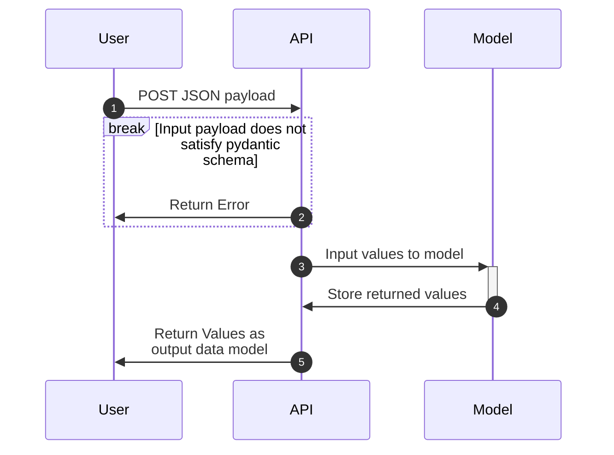

# Appplication Information
1) What does this application do?  
  This application provides a sentiment score as either positive or negative based on a fine tuned distilbert model. To build the application in Azure, use `kubectl apply -k .k8s/overlays/prod`

2) The K6 load test results and grafana dashboard screenshots can be seen below
    
    

### Sequence Diagram

