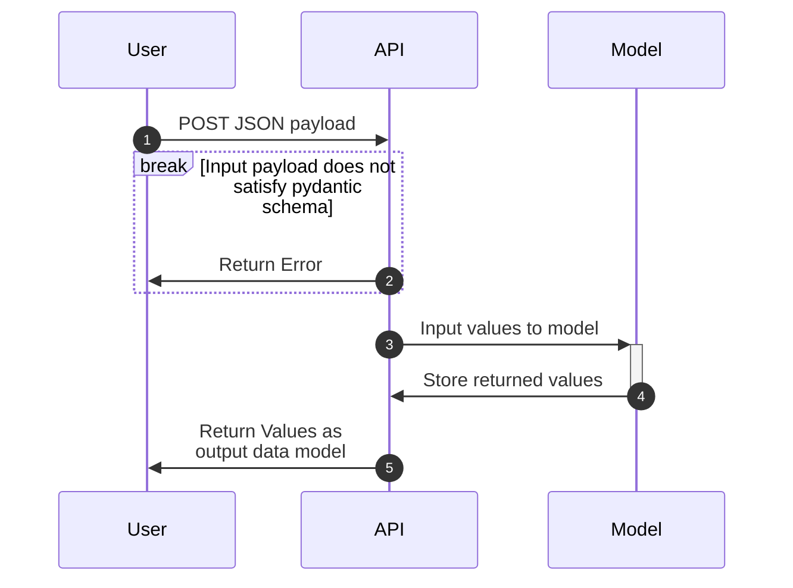

# Appplication Information
1) What does this application do?  
  This fastAPI application runs locally on your machine and contains several endpoints.  
  GET '/hello': It outputs "hello <name>" based on the name query parameter in the '/hello?name=<name>' endpoint.  
  POST '/predict': Accepts a JSON Object Request with the parameters "MedInc", "AveBedrms", "Population", "HouseAge", 
  "AveRooms", "Latitude", "Longitude", "AveOccup"

2)  How to build the application  
  Build the application with 'docker build . -t lab2_predict_app:v1'.

3)  How to run the application  
  Run the application with  on port 8000 with 'docker run -d -p 8000:8000 --name lab2_predict_app lab2_predict_app:v1'.  
    After you are finished running the application, stop the container with 'docker stop lab2_predict_app' followed by removing the container with 'docker rm lab2_predict_app'

4)  How to test the application
To test the application, run the ./tests/test_lab2.py script to assert the test cases pass by using 'poetry run pytest'. If there are any additional test cases that you would like to test, add them to the script before running.  
  To manually test, navigate to "http://localhost:8000/" and test each endpoint after running the application.  
    a) "/hello?name=nameparamter"  
    b) "/docs"  
    c) "/openapi.json"  
    d) "/requests"  
      Include the necessary inputs "MedInc", "AveBedrms", "Population", "HouseAge", "AveRooms", "Latitude", "Longitude", "AveOccup"

# Questions
1) What does Pydantic handle for us?
  Pydantic provides a validation for inputs and outputs from our Application. It is able to ensure the proper format and inclusion of the right parameters for our inputs, providing protection against malformed requests. It also helps confirm outputs from our Application. Pydantic manages all error handling natively and prevents us from hard coding HTTP status code responses. 

2) What do GitHub Actions do?
  Github Actions provide a repeatable framework for building and testing our application. Specifically, our Github Action is triggered on a pull request. The application built from the ground up and tested against all necessary test cases. Based on the successful passing of the test cases, a merge to the primary branch can be done with confidence of the applications functionality. 

3) In 2-3 sentences (plain language), describe what the Sequence Diagram below shows.
  The Sequence Diagram below provides the logical steps that occur when a user interacts with this applications '/predict' endpoint. First, the POSTed JSON payload is validated by Pydantic for the correct schema, if that does not pass, an error is returned to the user. If it does pass, the inputs are passed along to the backend model to provide a prediction based on the input which are returned to the user by the API in the desired output model. 

### Sequence Diagram

