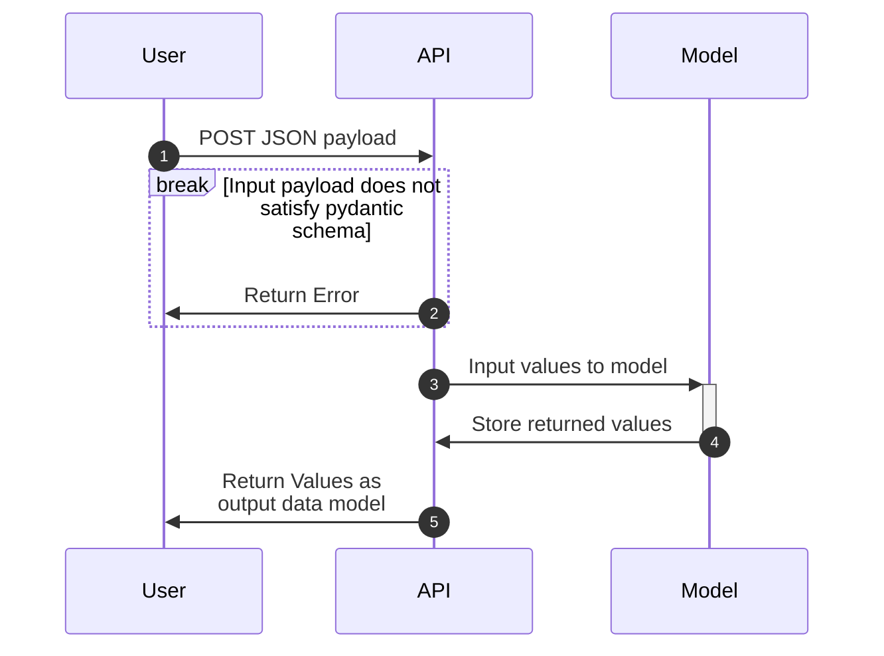

# Appplication Information
1) What does this application do?  
  This fastAPI application contains the 'hello' and 'predict' endpoints.  
  GET '/hello': Outputs "hello <name>" based on the name query parameter in the '/hello?name=<name>' endpoint.  
  POST '/predict': Accepts a JSON Object Request with the parameters "MedInc", "AveBedrms", "Population", "HouseAge", 
  "AveRooms", "Latitude", "Longitude", "AveOccup"

2)  How to build, run, and test the application
  run.sh will build, run, and test the application.  
  To manually build and test the application, follow along step by step with the run.sh instructions.

# Questions
1) What are the benefits of caching?  
  Caching protects the application from having to recalculate predictions on the backend for the same payload of information. This allows the application to perform better, scale, and also offloads the load on the backend for new requests. 
2) What is the difference between Docker and Kubernetes?  
  Docker is focused on the containerization of the application making the build and deployment of the application and its dependencies repeatable. Kubernetes acts as an orchestration layer managing the deployment and scalability of containerized applications (including Docker containers). 
3) What does a kubernetes deployment do?  
  A K8s deployment defines the desired state of an applicaiton by defining the number of replicas to have deployed as well as what containerized image to deploy.
4) What does a kubernetes service do?  
  Services provide the IP and DNS information necessary to access a K8s deployment and communicate across pods. 

### Sequence Diagram

