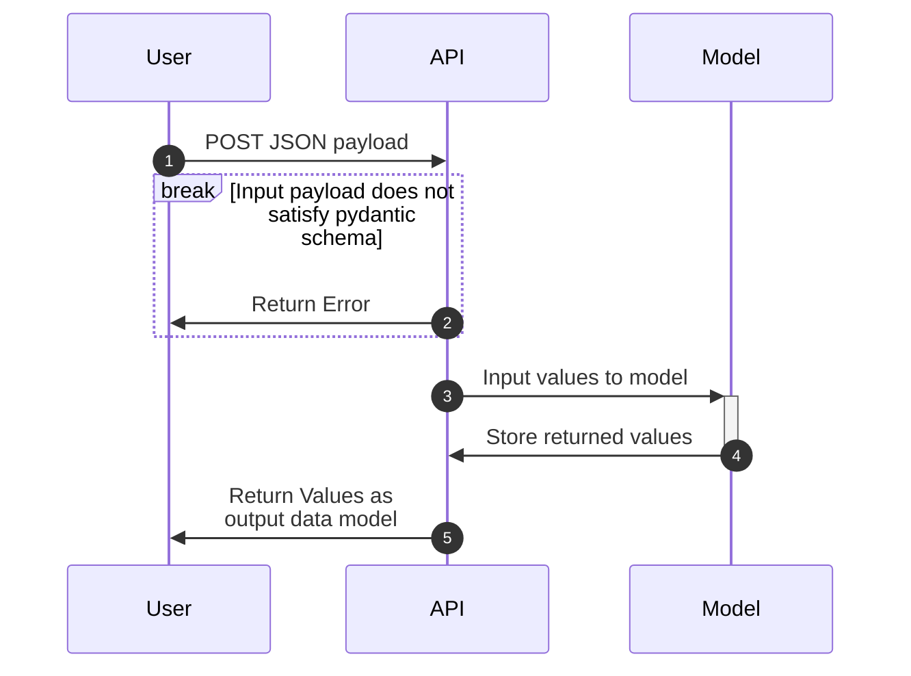

# Appplication Information
1) What does this application do?  
  This fastAPI application contains the 'hello' and 'predict' endpoints.  
  GET '/hello': Outputs "hello <name>" based on the name query parameter in the '/hello?name=<name>' endpoint.  
  POST '/predict': Accepts a JSON Object Request with the parameters "MedInc", "AveBedrms", "Population", "HouseAge", 
  "AveRooms", "Latitude", "Longitude", "AveOccup"

2)  How to build, run, and test the application
  To build this applicaiton, run the following command:  
  kubectl apply -k .k8s/overlays/prod

3)  Use the following curl to test the application:  
  curl -X 'POST' \\
    'https://shehzad.mids255.com/predict' \\
    -H 'accept: application/json' \\
    -H 'Content-Type: application/json' \\
    -d '{
    "homes": [
      {
        "MedInc": 0,
        "HouseAge": 0,
        "AveRooms": 0,
        "AveBedrms": 0,
        "Population": 0,
        "AveOccup": 0,
        "Latitude": 0,
        "Longitude": 0
      }
    ]
  }'

# Questions
1) What are the downsides of using latest as your docker image tag?  
  Using 'latest' as the docker image tag makes it difficult to track which verison of the image is being used. Explicitly stating which version of the image you are using provides additional information on where to look to debug if necessary.
2) What does kustomize do for us?  
  Kustomize allows us to configure different yamls on top of the base deployment for prod and dev environments without having to rewrite the whole yaml. We can patch existing parts of the base yaml or add entirely new sections like including istio in prod but not in dev.  

### Sequence Diagram

